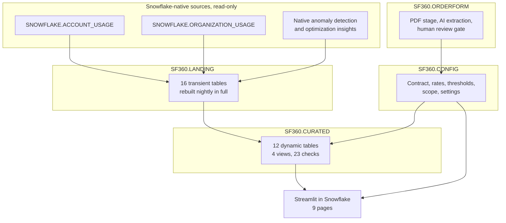
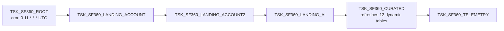

# Snowflake360

> Contract and capacity intelligence for your own Snowflake account or organization,
> built entirely on data every Snowflake account already has. Know where you stand
> against your capacity commitment, when it will run out, and which invoice is about
> to arrive early — before you learn it from the invoice.

---

## The problem this solves

A customer three quarters into a multi-year capacity contract received two invoices
in one quarter. Nothing was wrong with the billing. They had consumed more than one
installment's allocation, the contract permitted pull-forward, and the next invoice
arrived early. Every number involved was already in their account. Nothing had told
them in advance.

That is the failure mode Snowflake360 exists to prevent. It answers four questions
that Snowsight's cost views do not, because they need your contract terms as well as
your usage:

- How much of my capacity commitment have I actually consumed, counting rollover,
  free usage, adjustments and balance transfers — not just the purchase amount?
- On current pace, what date does it run out, and is that inside my term?
- Is any single installment period about to overspend its allocation and pull the
  next invoice forward?
- What happens to my per-credit price the day capacity is exhausted?

---

## What you build

| | |
|---|---|
| **9-page Streamlit app** | Setup and settings, contract position, consumption, usage, cost anomalies, warehouse optimization, cost attribution, product and AI usage, data sharing |
| **Dedicated warehouse** | `SF360_WH`, X-Small — every query the app makes runs here, so the cost of running Snowflake360 is one attributable line in your billing |
| **Order form ingestion** | Upload a capacity order form PDF; `AI_PARSE_DOCUMENT` and `AI_EXTRACT` pull out 18 contract fields for a human to confirm before anything is committed |
| **12 dynamic tables** | A curated dimensional model over `ACCOUNT_USAGE` and `ORGANIZATION_USAGE` |
| **6-task DAG** | Refreshes daily at 11:00 UTC, after Snowflake's attribution latency has settled |
| **23 verification checks** | Assertions against the specific ways an org-wide rollup can report a silently wrong number |
| **Least-privilege role** | `SF360_APP_ROLE` reads usage data and writes only your configuration |

Everything is Snowflake-native. There is no external service, no data movement, and
nothing leaves your account.

---

## What you will learn

1. **Dynamic tables** — a dependency-ordered curated model, and why `CURRENT_TIMESTAMP()` in a projection forces `FULL` refresh
2. **Task DAGs** — a six-task graph with a cron root and dependent children
3. **`ACCOUNT_USAGE` and `ORGANIZATION_USAGE`** — reconciling credits against currency, and why the two disagree by about half a percent
4. **Document AI** — `AI_PARSE_DOCUMENT` in `LAYOUT` mode plus `AI_EXTRACT`, with a human review gate
5. **Native cost intelligence** — consuming Snowflake's built-in anomaly detection and optimization insights instead of rebuilding them
6. **Streamlit in Snowflake** — a multi-page app deployed straight from a Git repository
7. **Least privilege in practice** — granular `SNOWFLAKE.*_VIEWER` database roles instead of blanket `IMPORTED PRIVILEGES`
8. **Query attribution** — the three-bucket split (attributed, warehouse idle, serverless) and why an attributed-only view understates cost badly

---

## Prerequisites

| Requirement | Why | If you do not have it |
|---|---|---|
| `ACCOUNTADMIN` | Creates the database, role, warehouse and API integration | Setup will fail. Ongoing use needs only `SF360_APP_ROLE`. |
| Cortex available in your region | Order form extraction uses `AI_PARSE_DOCUMENT` / `AI_EXTRACT` | Everything else works. Enter contract terms manually instead. |
| An **organization account** | `ORGANIZATION_USAGE` powers the org-wide and currency views | Setup detects this and sets `MODE = 'ACCOUNT'`. The app reports on this account only and says so — org panels explain their absence rather than showing zeros. |
| Usage history | Every figure comes from your own account | See "What to expect on a new account" below. |

Not required: Business Critical edition, a compute pool, external access integrations,
or any local tooling.

### What to expect on a new account

Snowflake360 ships **no sample data**, by design — it reports on your real spend. The
consequence is that a brand new or trial account has little to show. `ACCOUNT_USAGE`
retains roughly 365 days, but only accumulates from the day the account starts being
used, and a contract does not exist until you enter one.

The setup script measures this and tells you before you open the app:

```
OBJECTS_BUILT  REPORTING_MODE  DAYS_OF_HISTORY  CHECKS_PASSING  ACTIVE_CONTRACTS
47             ACCOUNT         14               19 of 23        0
```

Panels that cannot be computed say why. You will not see a blank chart or a `$0.00`
standing in for "no data yet".

---

## Quick start

### Step 1 — run the setup script

1. Open a Snowsight SQL worksheet.
2. Paste the entire contents of [`scripts/setup.sql`](scripts/setup.sql).
3. **Run All**, as `ACCOUNTADMIN`.

Takes 5–10 minutes, most of it the first data load. You need nothing installed
locally: Snowflake creates a Git repository object and fetches this repo itself.

If you forked the repo, change the GitHub owner in the two marked places at the top
of the script.

### Step 2 — enter your contract

Open **Projects → Streamlit → Snowflake360**. It opens on **Setup & Settings**
deliberately, not on a dashboard: nothing downstream is trustworthy until a contract
exists.

Either:

- **Contract tab** — type in the terms from your order form. This is the documented
  path and always works.
- **Order form tab** — upload the PDF and let `AI_EXTRACT` read it. On a real order
  form, 17 of 18 fields were correct first pass. **Every value still needs a human to
  confirm it**, because the one failure looked entirely plausible in isolation:
  capacity fees and On Demand fees sit in adjacent columns of the same table, and
  reading the wrong one changes the entire installment schedule.

### Step 3 — read your position

**Active Contract** is the day-to-day page. It leads with what to act on: capacity
exhaustion, a period pacing hot, a likely invoice pull-forward, or the price cliff
after exhaustion. Then capacity position, burn-down and forecast, contract terms,
billing cycles, thresholds, projections and account health.

---

## The pages

| Page | Answers |
|---|---|
| **Setup & Settings** | Order form ingestion, contract terms, billing and thresholds, negotiated rates, account scope, refresh and alerts |
| **Active Contract** | Where am I against my commitment, when does it run out, which invoice arrives early |
| **Consumption** | What am I spending, in currency, by account and service |
| **Usage** | What am I using, by feature, with small multiples per service type |
| **Cost Anomalies** | What changed unexpectedly — Snowflake's native anomaly detection, no custom models |
| **Warehouse & Optimization** | Which warehouses cost most, and Snowflake's own optimization insights |
| **Cost Attribution** | Who spent it — attributed to user and role, plus warehouse idle and serverless, which cannot be attributed to anyone |
| **Product & AI Usage** | Platform versus AI credit split, and which AI features |
| **Data Sharing** | Shares, listings and reader account consumption |

---

## Architecture



The DAG that drives it:



11:00 UTC is chosen: after Snowflake's roughly 8-hour query attribution latency has
settled, and before 8am US Central year-round, with no daylight-saving logic to get
wrong.

### Why the dynamic tables are all FULL refresh

This looks like an oversight and is not. Every curated table projects
`CURRENT_TIMESTAMP() AS BUILT_AT`, and a timestamp function in a SELECT list is not
supported for incremental refresh — only inside a `WHERE` filter.
`SHOW DYNAMIC TABLES` confirms the intent: `configured_refresh_mode` is `FULL` and
`refresh_mode_reason` is empty, meaning Snowflake never had to fall back.

Their `TARGET_LAG` is also inert on purpose. All twelve are
`scheduling_state = SUSPENDED`, and refreshes are driven in dependency order by
`SP_REFRESH_CURATED` from the DAG. `TARGET_LAG = DOWNSTREAM` would need an active
schedule, and the landing tables everything depends on are rebuilt by a task rather
than being dynamic tables themselves.

### Why landing tables are rebuilt in full every night

`ACCOUNT_USAGE` back-fills late-arriving rows. A trailing-window incremental load
would silently miss them, and "silently" is the problem — you would not know your
numbers were low. A full rebuild of a year of data costs seconds on an X-Small.

---

## What it costs to run

Snowflake360 runs entirely on its own warehouse, so you do not have to take our word
for it:

```sql
SELECT DATE_TRUNC('day', START_TIME) AS DAY, SUM(CREDITS_USED) AS CREDITS
FROM SNOWFLAKE.ACCOUNT_USAGE.WAREHOUSE_METERING_HISTORY
WHERE WAREHOUSE_NAME = 'SF360_WH'
  AND START_TIME >= DATEADD('day', -30, CURRENT_DATE())
GROUP BY 1 ORDER BY 1;
```

Measured on the development account — roughly a year of `ACCOUNT_USAGE` and an
organization of about 8,500 accounts:

| | |
|---|---|
| Full nightly DAG | 156 seconds, all six tasks |
| Largest single operation | rebuilding query attribution, ~19 GB scanned, under 35 s |
| Spilling to remote storage | **zero** — which is the signal that would justify a bigger warehouse |
| Warehouse | X-Small, `AUTO_SUSPEND = 60`, suspended between runs |

The AI order-form extraction is metered separately, per document, and only runs when
you upload one. Interactive use adds whatever your own querying costs.

`WAREHOUSE_TYPE` is `STANDARD` rather than adaptive on purpose: adaptive warehouses
are gated by region and edition, so requiring one would make setup fail to install in
some accounts — and adaptive is a performance feature, not a cost reduction, so it
would not lower the figure above.

---

## Security

`SF360_APP_ROLE` is deliberately narrow:

- **Reads** everything in `SF360`, and reads Snowflake's usage data through nine
  granular database roles — `USAGE_VIEWER`, `ORGANIZATION_USAGE_VIEWER`,
  `ORGANIZATION_BILLING_VIEWER`, `ORGANIZATION_ACCOUNTS_VIEWER`,
  `GOVERNANCE_VIEWER`, `OBJECT_VIEWER`, `SECURITY_VIEWER`, `SHARING_USAGE_VIEWER`,
  `READER_USAGE_VIEWER` — rather than blanket `IMPORTED PRIVILEGES ON DATABASE
  SNOWFLAKE`, which would grant read access to far more than this app looks at.
- **Writes** only `CONFIG` and `ORDERFORM`, the two schemas holding what you typed in
  or uploaded. `LANDING` and `CURATED` get no write grant at all; they are written by
  the refresh procedures.
- **Creates nothing.** No `CREATE` privilege on any schema.

Audit it yourself at any time:

```bash
SNOWFLAKE_DEFAULT_CONNECTION_NAME=<conn> python tools/audit_grants.py
```

That exits non-zero if the role has picked up a schema privilege it does not need.

Order form PDFs are stored on an internal, server-side-encrypted stage inside your
account. `AI_PARSE_DOCUMENT` cannot read client-side encrypted files, which is why
the stage is SSE — and the file never leaves your account.

---

## Modify it with Cortex Code

The setup script is the deploy path. If you want to change the app, work locally:

```bash
git clone https://github.com/sfc-gh-srahman/snowflake360.git
cd snowflake360
coco .
```

Useful prompts once it is open:

- *"Explain how capacity position is calculated and which config fields feed it"*
- *"Add a page showing spend by warehouse size over the last 90 days"*
- *"Why is FCT_CONTRACT_POSITION a dynamic table rather than a view?"*
- *"Run the verification suite and explain any failures"*

To push a change without going through Git:

```bash
cd streamlit
snow streamlit deploy --replace          # uploads the working copy to the stage
```

Note the tradeoff: once you deploy from the stage, the app is no longer tracking the
Git repository. Re-run the `CREATE STREAMLIT ... FROM '@...SF360_REPO/...'` statement
from `setup.sql` to put it back on the repo.

### Local development

```bash
python -m venv .venv && .venv/bin/pip install streamlit pandas altair snowflake-snowpark-python
SNOWFLAKE_DEFAULT_CONNECTION_NAME=<conn> .venv/bin/streamlit run streamlit/Snowflake360.py
```

There is no default connection name on purpose. A missing one used to fall back to a
developer's own profile, which fails confusingly on anyone else's machine.

### Tests

```bash
# 23 assertions against silently-wrong rollups
SNOWFLAKE_DEFAULT_CONNECTION_NAME=<conn> python tests/verification.py

# renders all 9 pages on the Snowpark path SiS uses, catching SiS-only breakage
SNOWFLAKE_DEFAULT_CONNECTION_NAME=<conn> SF360_QUERY_TAG_MODE=comment \
  python tests/sis_harness.py

# functional parity: object hashes + checks + every page's rendered metric values
SNOWFLAKE_DEFAULT_CONNECTION_NAME=<conn> python tests/parity.py capture --out tests/after
python tests/parity.py diff tests/baseline tests/after
```

Run the harness as the app role rather than as `ACCOUNTADMIN` — that is what
surfaced a missing `CORTEX_USER` grant that would have broken order form extraction
for the first real user:

```bash
SF360_TEST_ROLE=SF360_APP_ROLE SF360_TEST_WAREHOUSE=SF360_WH python tests/sis_harness.py
```

---

## Repository layout

```
snowflake360/
  scripts/
    setup.sql              one script, paste into Snowsight
    teardown.sql           removes everything, with a warning about your data
  streamlit/               the app; CREATE STREAMLIT points at this directory
    Snowflake360.py        entry point and Setup & Settings
    lib/{sf,style}.py      connection, query, formatting, visual language
    pages/1..8_*.py
    environment.yml
    snowflake.yml          for `snow streamlit deploy` only
  sql/
    baseline/              per-schema DDL, run by setup.sql from the repo in
                           dependency order: orderform, orderform_seed, config,
                           config_seed, warehouse, landing, curated, app, tasks,
                           grants
    40..49_*.sql           development-order files, source of truth for WHY
  tests/                   verification, SiS harness, parity harness
  tools/audit_grants.py    least-privilege check
  docs/                    architecture notes and the guide narrative
```

`sql/baseline/` holds the deployable definitions; the numbered `sql/` files hold the
reasoning, because `GET_DDL` strips comments. When they disagree about intent, the
numbered file is the record of why.

---

## Troubleshooting

**Org-wide pages say organization data is unavailable.** Expected outside an
organization account. Setup sets `MODE = 'ACCOUNT'`; per-account reporting still works.

**Verification checks fail right after setup.** Most of the 23 depend on a contract.
Enter one on Setup & Settings and re-run `python tests/verification.py`.

**Order form extraction fails.** Needs Cortex in your region and
`SNOWFLAKE.CORTEX_USER` on the role, which `grants.sql` grants. Check with
`SELECT AI_COMPLETE('claude-4-sonnet','ok');` as `SF360_APP_ROLE`. Enter the contract
manually in the meantime.

**The app is empty.** Check `DAYS_OF_HISTORY` from the setup output. A new account has
little history, and Snowflake360 reports only what you actually used.

**`Unsupported statement type 'ALTER_SESSION'`.** Streamlit in Snowflake runs inside a
stored-procedure sandbox that rejects `ALTER SESSION`. The app probes for this once and
falls back to carrying its query tag as a SQL comment. If you see it raised, the probe
in `lib/sf.py` has been bypassed.

**Task graph will not update.** `091421: root task is not suspended`. Suspend
`TSK_SF360_ROOT` first, make the change, then resume.

**Verification checks fail after re-running setup.** Re-running recreates the LANDING
tables empty, because they are derived and rebuilt nightly. `setup.sql` reloads them
in Section 6, so a full re-run is fine — but if you ran only the DDL, call the four
`SP_REBUILD_LANDING*` procedures and then `SP_REFRESH_CURATED` before judging the
checks.

---

## License

Apache 2.0. See [LICENSE](LICENSE).

Provided as is. It reads your account's usage data and your contract terms; it does not
send them anywhere.
