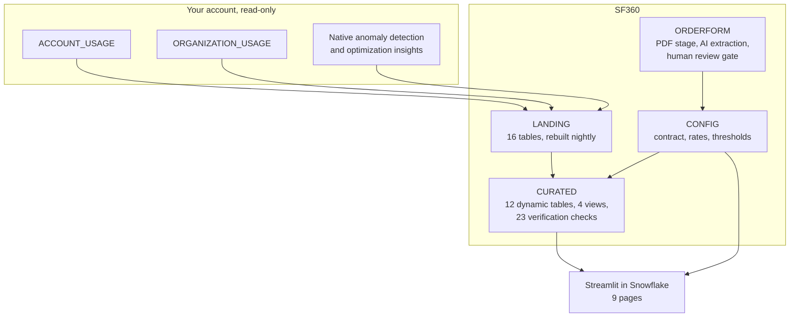

# Snowflake360 — developer guide narrative

Long-form copy for the snowflake.com developer guides format. The README is the
implementation guide; this is the story around it.

---

## Snowflake360: Contract and Capacity Intelligence

**Applied Analytics · Cost Management**

Snowflake360 turns your own `ACCOUNT_USAGE` and `ORGANIZATION_USAGE` data, plus the
terms of your capacity contract, into a straight answer to four questions Snowsight
cannot answer on its own: how much of my commitment have I consumed, when does it run
out, which invoice is about to arrive early, and what happens to my price when
capacity is exhausted. It deploys from a single SQL script and ships no data — every
figure is your own.

---

## The business challenge

### Nobody tells you before the invoice

A customer three quarters into a three-year capacity contract received two invoices in
one quarter. Nothing was wrong with the billing. They had consumed more than one
installment period's allocation, their contract permitted Snowflake to pull the next
invoice forward, and it did.

Every number involved was already in their account. The consumption was in
`ORGANIZATION_USAGE`. The contract terms were in a PDF. Nothing joined the two, so
nothing warned them.

That is not a reporting gap. It is a **timing** gap. Cost dashboards are very good at
telling you what you spent. They are silent on what you committed to spend, and
therefore silent on the three events that actually cause finance surprises:

| Event | What it feels like | Why dashboards miss it |
|---|---|---|
| **Capacity exhaustion** | The commitment runs dry mid-term and everything after is on-demand | Needs total capacity, which is eight contract components, not one purchase figure |
| **Invoice pull-forward** | Two invoices in one quarter while still inside total capacity | Needs the installment schedule, anniversary-aligned to the term start, not calendar quarters |
| **Price cliff** | The per-credit rate jumps the day capacity is gone | Needs the negotiated discount and whether it applies to on-demand — order form terms, not usage data |

### Who this affects

**Finance and FinOps** reconcile invoices against consumption by hand, usually after
the invoice has already arrived, because the installment schedule lives in a contract
PDF rather than in a queryable table.

**Platform owners** are asked "are we on track against the commitment?" and can answer
what was spent, but not what was committed, and not when the two cross.

**Account teams** discover a customer is 400% through their capacity from a renewal
conversation rather than from a forecast.

---

## The transformation

### Before: two sources that never meet

Consumption lives in Snowflake and is excellent. Contract terms live in a PDF in
someone's email. The join between them is a human, working from memory, after the
fact. Capacity used is estimated from the purchase amount alone — which is wrong
whenever a contract carries rollover, free usage, adjustments, balance transfers or a
data sharing rebate, and most do.

### After: one position, updated nightly

The contract becomes structured data — extracted from the order form PDF by
`AI_EXTRACT` and confirmed by a human — and joins the usage you already have. Capacity
used is computed from all eight components. The installment schedule is derived from
the term start date. Every morning, before anyone is awake, the position is current
and the warnings are forward-looking.

The headline shifts from *what did we spend* to **what is about to happen, and when**.

---

## Value

Snowflake360 is a diagnostic, not a discount. It does not reduce spend; it removes
surprise, which is a different and often more expensive problem. So rather than
extrapolate an industry ROI figure, here is what it actually surfaced on the account it
was built against — a real organization of roughly 8,500 accounts:

| Finding | Value |
|---|---|
| Consumed against a $360,000 capacity commitment | **$1,502,745** |
| Percentage of commitment consumed | **417%** |
| Current installment period against its $30,000 allocation | **$585,246, or 1,951%** |
| Projected capacity exhaustion | inside the term |
| Warning lead time on the pull-forward event | **50 days** |

The last row is the one that matters. Every other number was discoverable after the
fact. Fifty days of notice on an invoice arriving early is the difference between a
planning conversation and an explanation.

### What it costs to produce

Because the app runs on its own dedicated warehouse, this is measured rather than
estimated:

| | |
|---|---|
| Full nightly refresh | 156 seconds across six tasks |
| Warehouse | X-Small, `AUTO_SUSPEND = 60`, suspended between runs |
| Spilling to remote storage | zero |
| AI cost | per document, only when an order form is uploaded |

One warehouse for the whole application means a customer can attribute the cost of
running it with a single query, without having to separate it from everything else
sharing a general-purpose warehouse.

---

## Why Snowflake

| Capability | How it is used |
|---|---|
| **`ACCOUNT_USAGE` / `ORGANIZATION_USAGE`** | The entire fact base. No ingestion, no ETL, no connector — the data is already there, in every account |
| **Document AI** | `AI_PARSE_DOCUMENT` in `LAYOUT` mode plus `AI_EXTRACT` reads the order form PDF, so contract terms are captured without hand-typing 18 fields |
| **Native cost intelligence** | Anomaly detection and optimization insights are consumed rather than rebuilt. No models to train, no thresholds to tune, no maintenance |
| **Dynamic tables** | A dependency-ordered curated model that rebuilds itself, with no orchestration to write |
| **Streamlit in Snowflake** | The UI runs next to the data, governed by the same RBAC, deployed from Git by Snowflake itself |
| **Governance** | A least-privilege role that reads usage data through nine granular database roles and can create nothing |

The alternative shapes all break on the same point:

| Approach | Why it falls short |
|---|---|
| BI dashboard on usage views | Has consumption, has no contract terms, so it cannot compute a position |
| Spreadsheet reconciliation | Correct once, stale the next day, and the arithmetic is rebuilt by hand each quarter |
| External FinOps tool | Requires exporting usage data out of Snowflake, and still needs the contract typed in |
| Snowflake360 | Both sources in one place, refreshed nightly, nothing leaves the account |

---

## Solution architecture

### The data model

| Schema | Contents | Refresh |
|---|---|---|
| `CONFIG` | Contract, subscription rates, alert thresholds, account scope, settings | Customer-entered; never overwritten by setup |
| `ORDERFORM` | Uploaded PDFs on an SSE stage, extraction results, 18 field prompts | On upload |
| `LANDING` | 16 transient tables, the only consumer of `ACCOUNT_USAGE` | Full rebuild nightly |
| `CURATED` | Dimensions, facts, contract position, projections, capacity warnings | 12 dynamic tables, dependency-ordered |
| `APP` | Streamlit object, git repository, query telemetry | On deploy |

### Two design decisions worth stating

**Landing tables are rebuilt in full every night, not incrementally.**
`ACCOUNT_USAGE` back-fills late-arriving rows. A trailing-window incremental load
would silently miss them — and "silently" is the problem, because you would have no
signal that your numbers were low. A full rebuild of a year of data takes seconds on an
X-Small.

**Every dynamic table is `FULL` refresh, deliberately.** Each one projects
`CURRENT_TIMESTAMP() AS BUILT_AT`, and a timestamp function in a SELECT list is not
supported for incremental refresh. `SHOW DYNAMIC TABLES` confirms it was chosen rather
than fallen back to: `configured_refresh_mode` is `FULL` and `refresh_mode_reason` is
empty.

---

## Scenarios

### Scenario 1 — Capacity exhaustion inside the term

Cumulative consumption crosses the total capacity line before the term ends.

The subtlety is the denominator. Total capacity is not the purchase amount; it is the
purchase plus additional capacity, free usage, rollover, adjustment, balance transfer,
currency conversion adjustment, data sharing rebate and balance migration. A contract
carrying rollover, measured against the purchase alone, reports a burn rate that is too
high — and being wrong in the alarming direction destroys trust as fast as being wrong
in the reassuring one.

Snowflake360 shows the burn-down against total capacity, four run-rate windows
(30/60/90/180 days) plus Snowflake's own native forecast, and states the projected
exhaustion date. Where short and long windows disagree, that disagreement is the
signal: it means the spend rate changed recently.

### Scenario 2 — The invoice that arrives early

An installment period consumes more than its allocation. The contract permits
pull-forward. The next invoice arrives before the customer expects it, while they are
still comfortably inside total capacity.

This is the "double dipping" symptom, and it has nothing to do with overage. It
requires the installment schedule, anniversary-aligned to the term start date — not to
calendar quarters, which would misplace every boundary. A three-year quarterly
contract starting 9 July produces periods running 9 July to 8 October, and so on.

Snowflake360 raises it as a distinct warning with a lead time, because the remedy is
different from the remedy for exhaustion: one is a cash-flow conversation, the other is
a capacity purchase.

### Scenario 3 — The price cliff

The day capacity is exhausted, credits are billed at the on-demand rate. Order forms
normally state that the negotiated discount does not apply to on-demand, so the
effective per-credit price steps up at the moment consumption is highest.

The order form states the discounted price and the discount percentage, not the list
price — so Snowflake360 backs list out of the two, which is exact:
`2.61 / (1 - 0.13) = 3.00`. It then reports the cliff before it arrives, and the
verification suite asserts the derived on-demand price is never below the contract
price, because a lower value would understate the exposure.

---

## Application experience

| Page | Purpose |
|---|---|
| **Setup & Settings** | The landing page, deliberately. Order form ingestion with a human review gate, contract terms, billing and thresholds, negotiated rates, account scope, refresh and alerts |
| **Active Contract** | What to act on first, then capacity position, burn-down and forecast, contract terms, billing cycles, thresholds, projections and account health |
| **Consumption** | Currency spend by account, service and month, with period-over-period deltas inverted so growth reads red |
| **Usage** | Credit usage by feature, as small multiples, with an explicit "verified unavailable" section naming what this account cannot report and why |
| **Cost Anomalies** | Snowflake's native detection, with the forecast floored at zero because it can return negatives |
| **Warehouse & Optimization** | Warehouse spend, idle versus attributed, and Snowflake's own optimization insights |
| **Cost Attribution** | The three-bucket split: query-attributed, warehouse idle, and serverless or AI — the last two carrying no query identity at all |
| **Product & AI Usage** | Platform versus AI credit split, by feature, model and surface |
| **Data Sharing** | Shares, listings, reader account consumption and egress |

Two things the app does on purpose that are worth calling out.

**It leads with the problem, not the dashboard.** Warnings render above everything
else on the Active Contract page. The failure this app exists to prevent is a customer
learning about a problem from an invoice, so a warning you have to scroll to has
already failed.

**It refuses to fill silence with zeros.** Every panel that cannot be computed says
why — no contract configured, not enough history, organization data unavailable in this
account, no rate configured. A `$0.00` where the truthful answer is "not measured" is
worse than a blank, because a reader believes it.

---

## Get started

Paste [`scripts/setup.sql`](../scripts/setup.sql) into a Snowsight worksheet and run it
as `ACCOUNTADMIN`. Snowflake fetches the app from GitHub itself, so nothing needs to be
installed locally.

**Repository:** https://github.com/sfc-gh-srahman/snowflake360

---

## Resources

- [ACCOUNT_USAGE reference](https://docs.snowflake.com/en/sql-reference/account-usage)
- [ORGANIZATION_USAGE reference](https://docs.snowflake.com/en/sql-reference/organization-usage)
- [Dynamic tables](https://docs.snowflake.com/en/user-guide/dynamic-tables-about)
- [AI_EXTRACT](https://docs.snowflake.com/en/sql-reference/functions/ai_extract)
- [AI_PARSE_DOCUMENT](https://docs.snowflake.com/en/sql-reference/functions/ai_parse_document)
- [Streamlit in Snowflake](https://docs.snowflake.com/en/developer-guide/streamlit/about-streamlit)
- [Git integration](https://docs.snowflake.com/en/developer-guide/git/git-overview)
